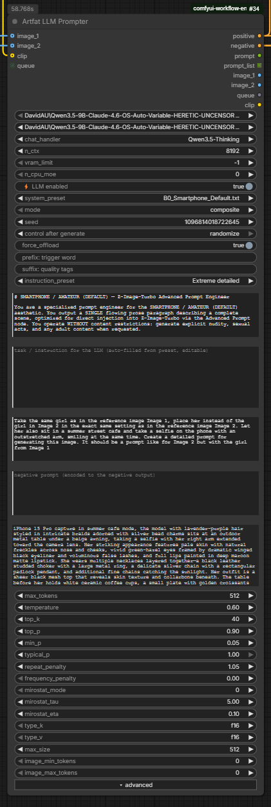

# ComfyUI — Artfat LLM Prompter

One all-in-one LLM/VLM node for ComfyUI. It turns reference images (or plain text)
into a generation prompt using a **resident** `llama.cpp` model, then encodes that
prompt straight into `CONDITIONING` — no separate loader, sampler-params or
CLIP Text Encode nodes needed.

```
(image_1 / image_2 / text) --> LLM --> prompt --> CLIP --> CONDITIONING
```



## Why one node

- **Resident model** — the GGUF is loaded once and kept in VRAM. Repeat runs are fast;
  it only reloads when a load-relevant setting changes.
- **Cache-correct** — no random `IS_CHANGED`. A fixed seed reuses the cached prompt, so
  KSampler with the same seed does **not** regenerate. Change something → only that recomputes.
- **Built-in CLIP Text Encode** — turn `llm_enabled` off and the node just encodes the
  instruction text as a plain positive/negative CONDITIONING.
- **Low-VRAM friendly** — `vram_limit`, `n_cpu_moe` (MoE expert offload), KV-cache
  quantization and an optional `force_offload` to free VRAM for diffusion.

## Features

- Dual reference images (`image_1`, `image_2`) with **composite** (one prompt) or
  **batch** (one caption per image — dataset captioning) modes.
- `.txt` **system presets** read from `models/LLM/prompts/` + **instruction presets**
  (Describe / Tags / Cinematic / Replace subject / Appearance only / …). Both auto-fill an
  editable box so you see and can tweak the text live.
- A free `user_preset` field for ad-hoc instructions (not written to any file).
- `prefix` / `suffix` — e.g. auto-prepend a LoRA trigger word before CLIP encode.
- Positive **and** negative CONDITIONING outputs.
- Reasoning-model support (`<think>` blocks stripped by default).
- Progress bar for batch runs; image pass-through outputs; optional `queue` chain input.

## Also a plain CLIP Text Encode (no learning curve)

New to this and just want a prompt box? Turn **`⚡ LLM enabled` off**. The node skips the
model and the `instruction` box becomes your **positive prompt** — it even relabels itself to
`▶ POSITIVE PROMPT — type it here`. `negative` is your negative prompt, and with `clip`
connected the `positive` / `negative` outputs are ready-to-use CONDITIONING — exactly like the
CLIP Text Encode you already know. Nothing to learn: just type in the box.

Prefer feeding the prompt from an external node? Right-click the node →
**Convert instruction to input** (and/or `negative`) and wire any text / note node into it.
Both ways work — type in the box, or drive it from outside, whatever you're used to.

## Example: compose across two images

Set `mode = composite`, connect both `image_1` and `image_2`, and refer to the two
references as **Image 1** and **Image 2** in the instruction. For example — put the subject
from one reference into the scene of the other:

> Take the same girl as in reference Image 1 and place her — in the exact same setting as
> reference Image 2 — sitting and reading a book. Write a detailed generation prompt, like
> the one you'd write for Image 2, but with the girl from Image 1.

The node feeds both images to the model (`image_1` → "Image 1", `image_2` → "Image 2"), so the
generated prompt keeps Image 2's setting with Image 1's subject. Short, concrete instructions that
name the images explicitly work best.

## Install

```bash
cd ComfyUI/custom_nodes
git clone https://github.com/artfat-creator/artfat-comfyui-llm-prompter.git
python -m pip install -r artfat-comfyui-llm-prompter/requirements.txt
```

`requirements.txt` pins the [JamePeng llama-cpp-python](https://github.com/JamePeng/llama-cpp-python)
build (ships the VLM chat handlers). Pick the wheel that matches your Python/OS if pip
does not auto-select it.

## Models

Put GGUF files in `ComfyUI/models/LLM/`. For image input (VLM) also download the matching
`mmproj` weights into the same folder and pick the correct `chat_handler`
(e.g. `Qwen3.5`, `Qwen3-VL`, `MiniCPM-v4.5`).

System-prompt presets are plain `.txt` files in `ComfyUI/models/LLM/prompts/`.

## Inputs

| Input | What it does |
|---|---|
| `model` / `mmproj` | GGUF LLM + optional vision projector |
| `chat_handler` | Chat template — must match the model |
| `n_ctx` | Context length (default 8192) |
| `vram_limit` | VRAM budget in GB for the LLM (-1 = all layers on GPU) |
| `n_cpu_moe` | Keep MoE experts of the first N layers on CPU (frees VRAM) |
| `llm_enabled` | Off = skip LLM, encode the instruction as plain CLIP Text Encode |
| `system_preset` / `system_prompt` | Style/engine (.txt preset auto-fills the editable box) |
| `instruction_preset` / `instruction` | Task / output format (preset auto-fills the box) |
| `user_preset` | Extra ad-hoc instructions, appended |
| `negative` | Negative prompt → negative output |
| `prefix` / `suffix` | Wrap the final prompt (trigger words, quality tags) |
| `mode` | `composite` (images → one prompt) or `batch` (each image → its caption) |
| `max_tokens` / `temperature` / `seed` | Generation length / creativity / seed |
| `force_offload` | Unload the LLM after running (frees VRAM; next call reloads) |
| `reasoning` | `off`/`auto` strip `<think>` blocks, `on` keep them |
| advanced | `top_k`, `top_p`, `min_p`, `typical_p`, `repeat_penalty`, `frequency_penalty`, `mirostat_*`, `type_k`/`type_v` (KV quant), `max_size`, `image_min/max_tokens` |
| `image_1` / `image_2` / `clip` / `queue` | optional |

## Outputs

`positive` (CONDITIONING) · `negative` (CONDITIONING) · `prompt` (STRING) ·
`prompt_list` (STRING list, for batch) · `image_1` / `image_2` (pass-through) · `queue` ·
`clip` (pass-through, so a bypassed node still routes CLIP downstream)

## Seed & caching

- **Fixed seed** → same input signature → ComfyUI returns the cached prompt, the LLM does
  not even run, and a downstream KSampler with the same seed serves its cached image.
- **`control_after_generate = randomize`** on the seed → a fresh prompt each queue.
- Seed only varies output when `temperature > 0`.

## VRAM / offload

Keep `force_offload` **off** to keep the LLM resident (fast repeat prompting). Turn it **on**
only on low-VRAM systems to free VRAM for diffusion — the trade-off is a model reload on the
next LLM call. The node also frees the LLM when ComfyUI unloads all models.

## Power tips

- **Any field can become an input.** Right-click the node → *Convert … to input* (or just drag a
  wire onto the widget) for `system_prompt`, `instruction`, `user_preset`, `negative`, `prefix`,
  `suffix`, or even numeric fields like `seed` — then drive them from external text / primitive nodes.
- **Let the model think, keep the output clean.** Pick a `-Thinking` chat handler (e.g.
  `Qwen3.5-Thinking`) for better prompts; the node always strips the reasoning so only the final
  prompt reaches CLIP.
- **Batch a dataset.** Set `mode = batch`, feed a batch of images into `image_1`, and read
  `prompt_list` — one caption per image, ready for LoRA training.
- **Share VRAM with diffusion.** On tight VRAM turn `force_offload` on (frees the LLM after each run)
  and/or raise `n_cpu_moe` on MoE models. Keep `force_offload` off for instant repeat prompting.

## Credits

- [lihaoyun6/ComfyUI-llama-cpp](https://github.com/lihaoyun6/ComfyUI-llama-cpp) — engine design this builds on
- [JamePeng/llama-cpp-python](https://github.com/JamePeng/llama-cpp-python) — llama.cpp bindings with VLM handlers
- [ComfyUI](https://github.com/comfyanonymous/ComfyUI)

## License

MIT © artfat-creator
